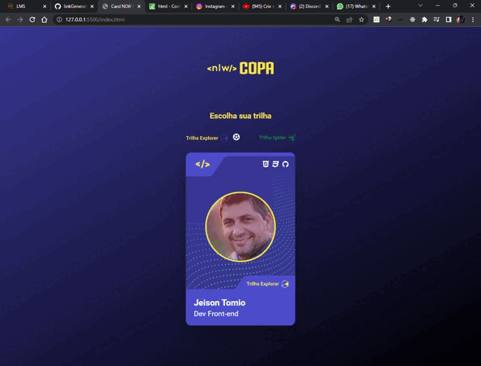

<h1 align="center">Card NLW Cup</h1>

<h1 align="center">
    <a href="https://app.rocketseat.com.br/">🔗 Rocketseat</a>
</h1>

🚀 Projeto de card com temática da Copa do Mundo.

 
<h4 align="center">
	🚧  1º Parte da última NLW do ano 🚀 Aguardando atualização...  🚧
</h4>

 

### Funções

- [x] Mostra imagem (Avatar) usuário
- [x] Alterar tema do card e background body
- [x] Parte do projeto NLW Copa
- [ ] Aguardando atualizações

### Preview

> 📌 [Crie sua figurinha da Copa (HTML + CSS + JS)](https://www.youtube.com/watch?v=sswJisbD2CY&t=2307s)

### Pré-requisitos

Antes de começar, você vai precisar ter instalado em sua máquina as seguintes ferramentas:
[Git](https://git-scm.com),
Além disto é bom ter um editor para trabalhar com o código como [VSCode](https://code.visualstudio.com/)
Ou alguma IDE de sua preferência.

### 🛠 Tecnologias

As seguintes ferramentas foram usadas na construção do projeto:

- [HTML](https://developer.mozilla.org/pt-BR/docs/Web/HTML)
- [CSS](https://developer.mozilla.org/pt-BR/docs/Web/CSS/)
- [JavaScript](https://www.javascript.com/)

### Autor

---

<a href="https://github.com/Jtomio">
 
  
 <b>Jeison Tomio</b></a>

👋🏽 Entre em contato!

